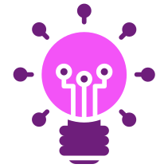

<p align="center">
  
</p>

<h1 align="center">ReactJs AI Chat </h1>

<p align="center">
  An AI Chat built in ReactJs and connected to the OpenAI API.
</p>

<p align="center">
  <a href="#-technologies">Technologies</a>&nbsp;&nbsp;|&nbsp;&nbsp;
  <a href="#-packages">Packages</a>&nbsp;&nbsp;|&nbsp;&nbsp;
  <a href="#-getting-started">Getting started</a>&nbsp;&nbsp;|&nbsp;&nbsp;
  <a href="#-layout">Layout</a>&nbsp;&nbsp;|&nbsp;&nbsp;
  <a href="#-features">Features</a>&nbsp;&nbsp;|&nbsp;&nbsp;
  <a href="#-links">Links</a>&nbsp;&nbsp;|&nbsp;&nbsp;
  <a href="#author">Author</a>
</p>

<p align="center">
  
  
  
</p>

<br>

<p align="center">
  
</p>

## 🚀 Technologies

Here are the technologies used in this project.

- TypeScript 4.9.3
- ReactJS 18.2.0
- Tailwindcss 3.2.4
- OpenAi 3.1.0
- Vite 4.0.0

---

## 📦 Packages

Here are the packages used in this project.

- OpenAi -> OpenAI Node.js library that provides access to the OpenAI API.
- phosphor-react -> Library with various icon providers for react.
- clsx -> Utility for constructing className strings conditionally.

---

## 💻 Getting started

Here are the commands and steps on how to start the project.

**Dependency**

- NodeJS
- NPM (Package manager of your choice)

---

Install the dependencies using a package manager, the one used in the project was NPM.

```
npm install
```

To start the project on your machine using NPM.

```
npm run dev
```

To build the project using NPM.

```
npm run build
```

To run the project in production using NPM.

```
npm run start
```

---

## 🔖 Layout

Here are some images of the project's visual style.

### 1 - Index page (/)

Home page where you can do the math.


## 🔥 Features

Here are the main features of the project.

- Responsive design.
- Context Providers.
- OpenAi connected.

---

## 📎 Links

- Deploy on [Vercel](https://vercel.com/): https://dsg-ai-chat.vercel.app/
- Repository: https://github.com/dsg1407/ai-chat

---

## Author

Made with ♥ by Daniel Gonçalves 🚀 [dsg1407](https://github.com/dsg1407)
